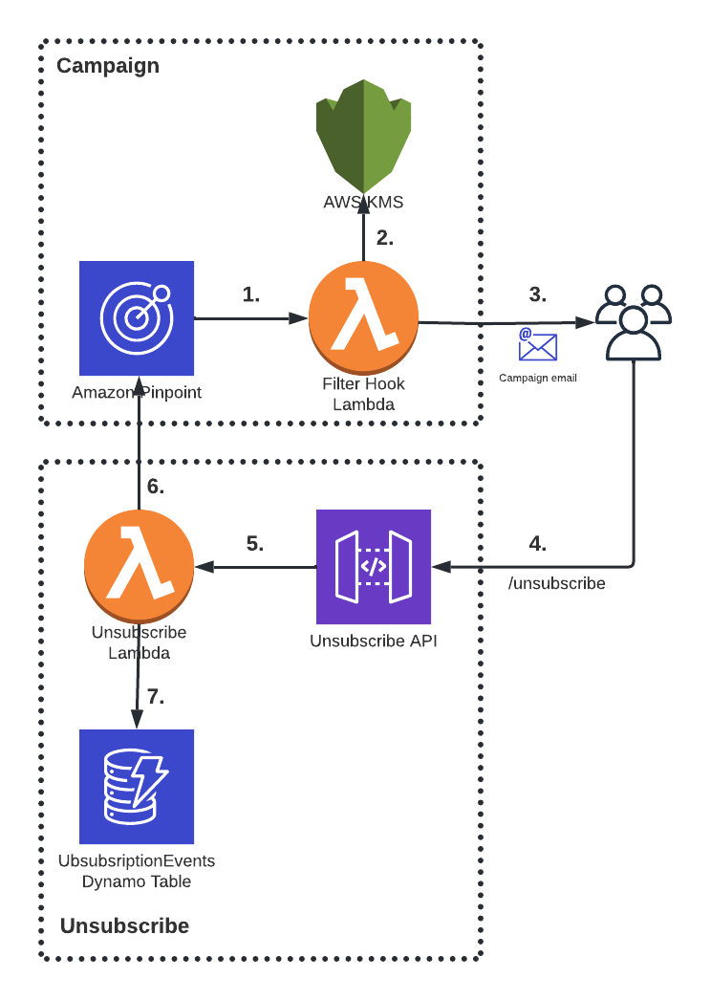

# Plusheno Meche Campaign
Work in progress.

AWS SAM based application for sending campaing emails with AWS Pinpoint. The application exposes a public REST endpoint for unsubscription from the campaigns. 

# Architecture

### Campaign
1. The user initiates an email campaign from Pinpoint
2. A Lambda function hook adds a signature to the recipient endpoint data, before the campaign emails are generated. It uses KMS to encrypt the signature which contains customer-specific information.
3. The campaign emails are generated with an unsubscribe link containing the signature.

### Unsubscribe
4. The recipient clicks the unsubscribe link in the campaign email. It hits the `/unsubscribe` rest endpoint exposed by API Gateway
5. API Gateway triggers the unsubscribe Lambda function 
6. The unsubscribe lambda extracts the signature. It calls Pinpoint to unsubscribe the endpoint from the campaign.
7. The unsubscribe lambda stores the unsubscription result in the UnsubscribeEvents Dynamodb table.